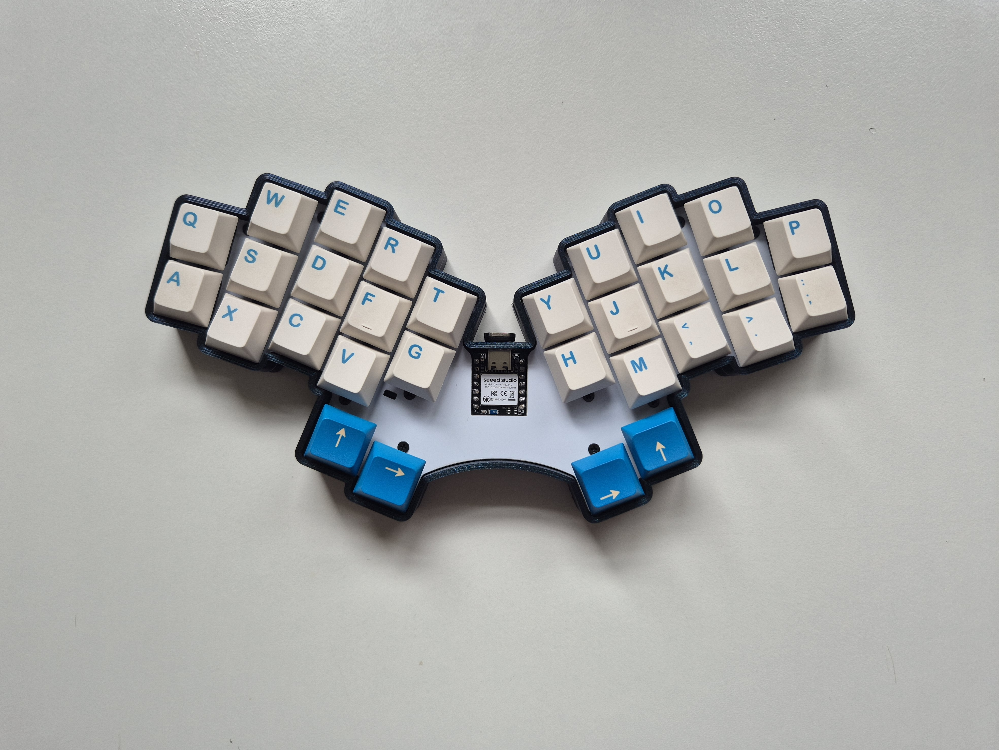
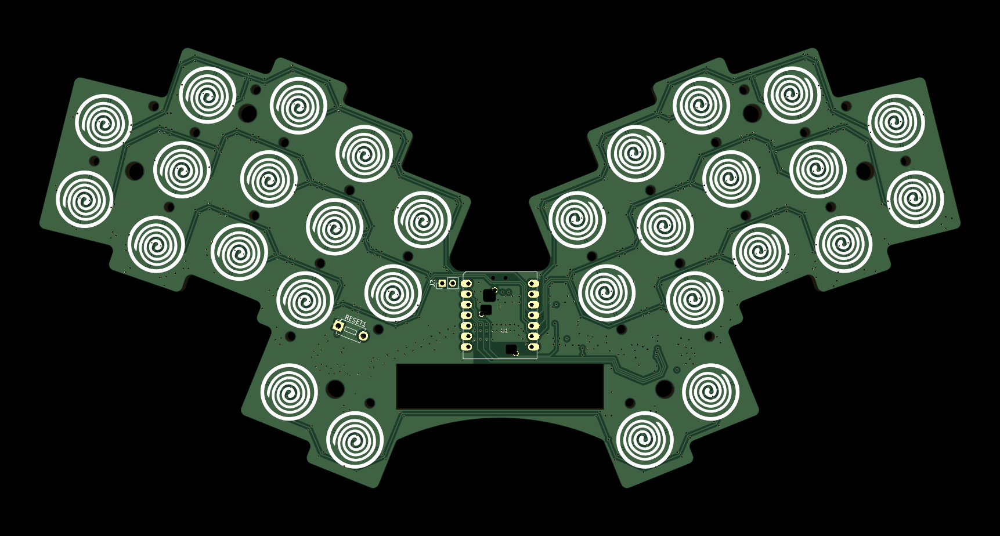
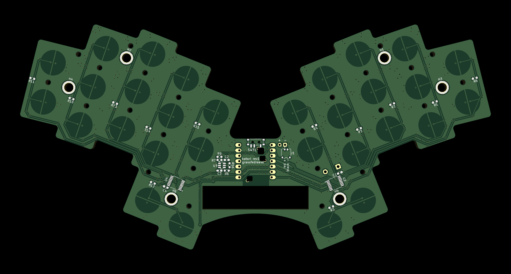

# katori
30-key wireless topre/ec hummingbird keyboard based on the [rufous](https://github.com/jcmkk3/trochilidae) & [topreviung](https://gitlab.com/lpgalaxy/topreviung) 
---- 
named after katori senkō mosquito coils that inspired the original conical spring design for topre switches, as well as katori's translation to bird as homage to the hummingbird.

## Status
Revision 1 has been built and tested. Had design error fixed in r2 but yet to be officially ordered

## Manufacturing

Can be hand soldered or ordered assembled using assembly files

Currently setup to use a 1.2mm aluminum single layer pcb as the plate

- [PCB production files](./production/)
- [Plate files](./plate/)
- [Case files](./case)

## Parts needed
- 1 pcb
- 1 plate
- 1 case
- 1 seeed xiao compatible controller
- 30 1u EC housing + slider
- 30 Rubber domes
- 30 Conical springs
- 26 [m1.6 5mm full thread standoffs](https://www.aliexpress.com/item/1005004397115309.html) 
- 1 [3x6x5 tht reset switch](https://www.aliexpress.com/store/1103739763)
- 26 m1.6 3mm screws
- 6 m3 3mm screws

## BOM
- 1 PCM12SMTR - power switch
- 7 SMTSO3020MTJ - SMD solder nut
- 2 TSSOP-16 multiplexers
- 1 0603 1k resistor
- 13 0603 100k resistors
- 3 0603 100n capacitors
- 1 0603 220pF capacitor

**Optional**
- Silencing rings
- [450mah 601148 battery](https://www.aliexpress.com/item/32844347206.html)
- 1 PCM12SMTR - power switch

#### PCB Renders

## Inspiration & Thanks
- jcmkk3's [rufous](https://github.com/jcmkk3/trochilidae#rufous) hummingbird variation, of which I used the Ergogen config and splay etc.
- pete johanson for his incredible help during the project and his [topreviung](https://gitlab.com/lpgalaxy/topreviung) keyboard, which was the basis of the schematic and entire EC portions.
- PJE66's original [hummingbird](https://github.com/PJE66/hummingbird) keyboard

## Acknowledgements 
Thank you to [PCBWay](https://www.pcbway.com/) for sponsoring this project!

You can find and order the parts for this project on PCBWay using these links:

[pcb](https://www.pcbway.com/project/shareproject/Katori_30_key_wireless_topre_ec_hummingbird_keyboard_7163f60f.html)
[plate](https://www.pcbway.com/project/shareproject/Katori_Plate_a08691e4.html)

